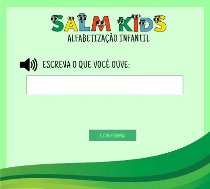

# salmkids
Este repositório abriga imagens da aplicação SALM Kids.
A Figura 1 apresenta a interface da tela principal (e inicial, até o momento). Nela, o usuário é capaz de ouvir a palavra selecionada e, dentro da lacuna em branco, pode escrever a palavra de acordo com a pronúncia.

  
Conforme evidenciado na Figura 2, após a confirmação da escrita, o programa demonstra através de cores o resultado da tentativa do aluno. Como dito anteriormente, a cor verde indica que a letra está na posição certa, amarela indica que a letra se encontra na posição errada, e a vermelha indica que a letra está incorreta, ou seja, não existe na palavra escolhida.

Figura 2: Correção da tentativa.
