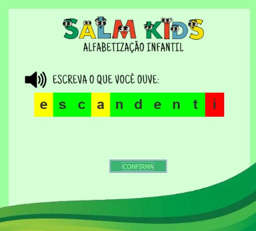

# SALMKids
Este repositório abriga a aplicação SALM Kids.

SALM Kids foi um aplicativo desenvolvido com o intuito de inovar o processo de alfabetização de crianças no país utilizando tecnologia e enfrentar as deficiências no processo de ensino tradicional. Unindo conceitos de Álgebra Linear e Programação Orientada a Objetos, a ferramenta visa identificar e abordar dificuldades específicas de cada criança enquanto apresenta uma interface divertida e simples, estimulando o engajamento dos alunos e possibilitando um aprendizado mais flexível.

A Figura 1 apresenta a interface da tela principal (e inicial, até o momento). Nela, o usuário é capaz de ouvir a palavra selecionada e, dentro da lacuna em branco, pode escrever a palavra de acordo com a pronúncia.

  
Conforme evidenciado na Figura 2, após a confirmação da escrita, o programa demonstra através de cores o resultado da tentativa do aluno. Como dito anteriormente, a cor verde indica que a letra está na posição certa, amarela indica que a letra se encontra na posição errada, e a vermelha indica que a letra está incorreta, ou seja, não existe na palavra escolhida.

